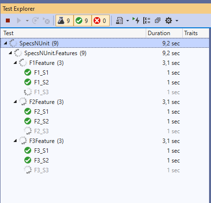

# Parallel Execution

SpecFlow scenarios are often automated as integration or system level tests. The system under test (SUT) might have several external dependencies and a more complex internal architecture. The key design question when running the tests in parallel is how the parallel test executions can be isolated from each other.

## Test Isolation Levels

Determining the ideal level of isolation for your automated tests is a tradeoff. The higher the isolation of the parallel tests the smaller the likelihood of conflicts on shared state and dependencies, but at the same time the higher the execution time and amount of resources needed to maintain the isolated environments.

| Isolation level | Description | Runner support |
| --------------- | ----------- | -------------- |
| Thread | Test threads run as threads in the same process and application domain. Only the thread-local state is isolated. | NUnit, MsTest, xUnit, SpecFlow+Runner (SharedAppDomain isolation) |
| Application domain  (.NET framework only) | Test threads run in the same process but in separate AppDomain instances. The AppDomain provides e.g. an isolated static state. | SpecFlow+Runner (AppDomain isolation) |
| Process | Test threads run in separate processes. | SpecFlow+Runner (Process isolation), VSTest per test assembly |
| Agent | Test threads run on multiple agents. | E.g. VSTest task |

## Parallel Scheduling Unit

Depending on the test isolation level and the used test runner tools you can consider different "units of scheduling" that can run in parallel with each other.
When using SpecFlow we can consider the parallel scheduling on the level of scenarios, features and test assemblies.

| Scheduling unit  | Description          | Runner support       |
| ---------------- | -------------------- | -------------------- |
| Scenario         | Scenarios can run in parallel with each other (also from different features) | SpecFlow+ Runner     |
| Feature          | Features can run in parallel with each other. Scenarios from the same feature are running on the same test thread. | NUnit, MsTest, xUnit |
| Test assembly    | Different test assemblies can run in parallel with each other | e.g. VSTest |

## Running SpecFlow features in parallel with thread-level isolation



### Properties

* Tests are running in multiple threads within the same process and the same application domain.
* Only the thread-local state is isolated.
* Smaller initialization footprint and lower memory requirements.
* The SpecFlow binding registry (step definitions, hooks, etc.) and some other core services are shared across test threads.

### Requirements

* You have to use a test runner that supports in-process parallel execution (currently NUnit v3, xUnit v2, MSTest and SpecFlow+ Runner)
* You have to ensure that your code does not conflict on static state.
* You must not use the static context properties of SpecFlow `ScenarioContext.Current`, `FeatureContext.Current` or `ScenarioStepContext.Current` (see further information below).
* You have to configure the test runner to execute the SpecFlow features in parallel with each other (see configuration details below).

### Execution Behavior

* `[BeforeTestRun]` and `[AfterTestRun]` hooks (events) are executed only once on the first thread that initializes the framework. Executing tests in the other threads is blocked until the hooks have been fully executed on the first thread.
* All scenarios in a feature must be executed on the **same thread**. See the configuration of the test runners below. This ensures that the `[BeforeFeature]` and `[AfterFeature]` hooks are executed only once for each feature and that the thread has a separate (and isolated) `FeatureContext`.
* Scenarios and their related hooks (Before/After scenario, scenario block, step) are isolated in the different threads during execution and do not block each other. Each thread has a separate (and isolated) `ScenarioContext`.
* The test trace listener (that outputs the scenario execution trace to the console by default) is invoked asynchronously from the multiple threads and the trace messages are queued and passed to the listener in serialized form. If the test trace listener implements `TechTalk.SpecFlow.Tracing.IThreadSafeTraceListener`, the messages are sent directly from the threads.

### NUnit Configuration

By default, [NUnit does not run the tests in parallel](https://docs.nunit.org/articles/nunit/writing-tests/attributes/parallelizable.html).
Parallelisation must be configured by setting an assembly-level attribute in the SpecFlow project.

```c#
using NUnit.Framework;
[assembly: Parallelizable(ParallelScope.Fixtures)]
```

***>Note:** SpecFlow does not support scenario level parallelization with NUnit (when scenarios from the same feature execute in parallel). If you configure a higher level NUnit parallelization than "Fixtures" your tests will fail with runtime errors.*

### MSTest Configuration

By default, [MsTest does not run the tests in parallel](https://devblogs.microsoft.com/devops/mstest-v2-in-assembly-parallel-test-execution/).
Parallelisation must be configured by setting an assembly-level attribute in the SpecFlow project.

```c#
using Microsoft.VisualStudio.TestTools.UnitTesting;
[assembly: Parallelize(Scope = ExecutionScope.ClassLevel)]
```

***>Note**: SpecFlow does not support scenario level parallelization with MsTest (when scenarios from the same feature execute in parallel). If you configure a higher level MsTest parallelization than "ClassLevel" your tests will fail with runtime errors.*

### xUnit Configuration

By default xUnit runs all SpecFlow features [in parallel](https://xunit.net/docs/running-tests-in-parallel) with each other. No additional configuration is necessary.

### Thread-safe ScenarioContext, FeatureContext and ScenarioStepContext

When using parallel execution accessing the obsolete `ScenarioContext.Current`, `FeatureContext.Current` or `ScenarioStepContext.Current` static properties is not allowed.  Accessing these static properties during parallel execution throws a `SpecFlowException`.

To access the context classes in a thread-safe way you can either use context injection or the instance properties of the `Steps` base class. For further details please see the [FeatureContext](../Bindings/FeatureContext.md) and [ScenarioContext](../Bindings/ScenarioContext.md) documentation.

### Excluding SpecFlow features from parallel execution

To exclude specific features from running in parallel with any other features, see the `addNonParallelizableMarkerForTags` [configuration](../Installation/Configuration.html#generator) option.

Please note that xUnit requires additional configuration to ensure that non parallelizable features do not run in parallel with any other feature. This configuration is automatically provided for users via the xUnit plugin (so no additional effort is required). The following class will be defined within your test assembly for you:

``` C#
[CollectionDefinition("SpecFlowNonParallelizableFeatures", DisableParallelization = true)]
public class SpecFlowNonParallelizableFeaturesCollectionDefinition
{
}
```

## Running SpecFlow scenarios in parallel with AppDomain or Process isolation

If there are no external dependencies or they can be cloned for parallel execution, but the application architecture depends on static state (e.g. static caches etc.), the best way is to execute tests in parallel isolated by AppDomain or Process. This ensures that every test execution thread is hosted in a separate AppDomain and hence static state is not accessed in parallel. In such scenarios, SpecFlow+Runner can be used to execute tests in parallel without any extra considerations. [SpecFlow+ Runner supports parallel execution](https://specflow.org/plus/documentation/Execution/) with AppDomain, SharedAppDomain and Process isolation.

### Properties

* Tests threads are separated by an AppDomain or process boundary.
* Also the static memory state is isolated. Conflicts might be expected on external dependencies only.
* Bigger initialization footprint and higher memory requirements.

### Requirements

* You have to use SpecFlow+ Runner with AppDomain or Process isolation.

### Execution Behavior

* `[BeforeTestRun]` and `[AfterTestRun]` hooks are executed for each individual test execution thread (AppDomain or process), so you can use them to initialize/reset shared memory.
* Each test thread manages its own enter/exit feature execution workflow. The `[BeforeFeature]` and `[AfterFeature]` hooks may be executed multiple times in different test threads if they run scenarios from the same feature file. The execution of these hooks do not block one another, but the Before/After feature hooks are called in pairs within a single thread (the `[BeforeFeature]` hook of the next scenario is only executed after the `[AfterFeature]` hook of the previous one). Each test thread has a separate (and isolated) `FeatureContext`.
