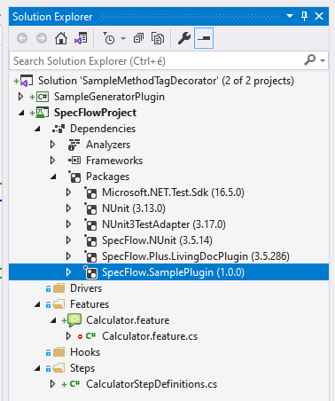
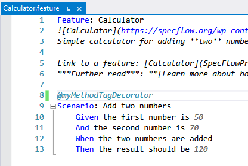
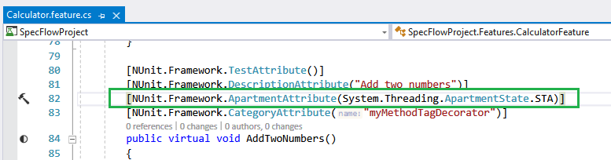

# Decorators

SpecFlow supports decorators which can be used in feature files. Decorators can be used to convert a tag in a feature file to an attribute in the generated code behind file.

## Example decorator

Say we want to add an NUnit `Apartment` attribute to a test method in the generated code behind file (a file with extension `.feature.cs`) to specify that the test should be running in a particular apartment, either the STA or the MTA.
For this, we can use a decorator which we need to register in a generator plugin so that the decorator can have its effect during the code behind file generation.

Steps to follow:

1. Create a SpecFlow project with test framework NUnit using the project template provided by the SpecFlow Visual Studio extension. [Learn more](../Installation/Project-and-Item-Templates.html#visual-studio-templates)

1. Create a GeneratorPlugin. You can follow the steps [here](./Plugins.html#sample-generator-plugin) or you can use the [sample generator plugin project](https://github.com/SpecFlowOSS/SpecFlow-Examples/tree/master/Plugins/GeneratorOnlyPlugin) as a basis

1. Create a Decorator (which is a class which implements interfaces like `ITestMethodTagDecorator`, `ITestMethodDecorator`, etc.):

    ```c#
    public class MyMethodTagDecorator : ITestMethodTagDecorator
    {
        public static readonly string TAG_NAME = "myMethodTagDecorator";
        private readonly ITagFilterMatcher _tagFilterMatcher;

        public MyMethodTagDecorator(ITagFilterMatcher tagFilterMatcher)
        {
            _tagFilterMatcher = tagFilterMatcher;
        }

        public bool CanDecorateFrom(string tagName, TestClassGenerationContext generationContext, CodeMemberMethod testMethod)
        {
            return _tagFilterMatcher.Match(TAG_NAME, tagName);
        }

        public void DecorateFrom(string tagName, TestClassGenerationContext generationContext, CodeMemberMethod testMethod)
        {
            var attribute = new CodeAttributeDeclaration(
                "NUnit.Framework.ApartmentAttribute",
                new CodeAttributeArgument(
                    new CodeFieldReferenceExpression(
                        new CodeTypeReferenceExpression(typeof(System.Threading.ApartmentState)),
                        "STA")));

            testMethod.CustomAttributes.Add(attribute);
        }

        public int Priority { get; }
        public bool RemoveProcessedTags { get; }
        public bool ApplyOtherDecoratorsForProcessedTags { get; }
    }
    ```

1. Register the Decorator in the `Initialize` method of the GeneratorPlugin:

    ```c#
    public void Initialize(GeneratorPluginEvents generatorPluginEvents, GeneratorPluginParameters generatorPluginParameters,
    UnitTestProviderConfiguration unitTestProviderConfiguration)
    {
        // Register the decorator
        generatorPluginEvents.RegisterDependencies += RegisterDependencies;
    }

    private void RegisterDependencies(object sender, RegisterDependenciesEventArgs eventArgs)
    {
        eventArgs.ObjectContainer.RegisterTypeAs<MyMethodTagDecorator, ITestMethodTagDecorator>(MyMethodTagDecorator.TAG_NAME);
    }
    ```

1. Install the GeneratorPlugin NuGet package to the SpecFlow project. Once the installation finishes, it should look like this:

    

1. Add tag `@myMethodTagDecorator` to the feature file:

    

1. Build the solution

1. Check the generated code behind file (`.feature.cs`) if it contains the NUnit `Apartment` attribute:

    

You can find [the complete Decorator example on GitHub](https://github.com/SpecFlowOSS/SpecFlow-Examples/tree/master/Decorators/SampleMethodTagDecorator).

## Further read

- NUnit `Apartment` attribute: <https://docs.nunit.org/articles/nunit/writing-tests/attributes/apartment.html>
- Apartments: <https://docs.microsoft.com/en-us/windows/win32/com/processes--threads--and-apartments>
