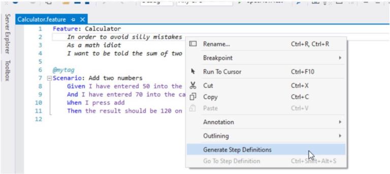

# Getting Started with a new Project

## Installation and Setup

Installing SpecFlow consists of two steps:

1.  Install the Visual Studio Extension
2.  Set up your Visual Studio project to work with SpecFlow

### Installing the Visual Studio Extension

The SpecFlow extension for Visual Studio provides a number of helpful features, such as syntax highlighting for Gherkin (feature) files. This extension is not required to use SpecFlow, but we recommend you install it if you are using Visual Studio. If you are not using Visual Studio on Windows, you will not be able to install the extension.

To install the extension, download the extension for your version of Visual Studio:

- [Visual Studio 2019](https://marketplace.visualstudio.com/items?itemName=TechTalkSpecFlowTeam.SpecFlowForVisualStudio)
- [Visual Studio 2017](https://marketplace.visualstudio.com/items?itemName=TechTalkSpecFlowTeam.SpecFlowforVisualStudio2017)
- [Visual Studio 2015](https://marketplace.visualstudio.com/items?itemName=TechTalkSpecFlowTeam.SpecFlowforVisualStudio2015)

Either choose to open the download directly, or double-click the extension once it has downloaded to install it in Visual Studio.

### Setting Up your SpecFlow Project

This section guides you through the first steps of setting up a Visual Studio project with SpecFlow and defining and executing your first test scenario. In this example, we will be using [SpecFlow+ Runner](https://www.specflow.org/plus/), but you can use a number of other test execution frameworks, including NUnit, xUnit or MSTest. SpecFlow+ Runner’s advantages include integration with Visual Studio Test Runner and extensive integrated reports available from within Visual Studio.

**SpecFlow+ Runner is available free of charge.** Learn more about [how to sign-up for your free account](https://specflow.org/2020/introducing-the-specflow-account/). After the successful sign-up you are able to execute your scenarios for the first time.

SpecFlow tests are usually placed into one or more separate projects in your solution, and these projects are referred to as a “specification project” below. The easiest and most convenient way to set up these projects is to use our [SpecFlow](http://www.nuget.org/packages/SpecFlow) NuGet package or one of the specific helper packages, like [SpecRun.SpecFlow](http://www.nuget.org/packages/SpecRun.SpecFlow) or [SpecFlow.NUnit](http://www.nuget.org/packages/SpecFlow.NUnit).

To set up your specification project:

1. Add an “MSTest Test Project (.NET Core)” to your solution (e.g. “MyProject.Specs”).  
    **Note:** Adding this simplifies the setup, as we will be using the .NET Core framework for this project. For a Full Framework project, select “Unit Test Project (.NET Framework)” instead.
2. Remove the _UnitTest1.cs_ file, as it is not required.
3. Right-click on your solution (e.g. “MyProject.Specs”) and select **Manage NuGet Packages for Solution**.
4. Install the following packages (use the search field to filter the search results):
   - SpecFlow
   - SpecFlow.Tools.MsBuild.Generation
   - SpecRun.SpecFlow
5. The Microsoft .NET Test SDK is also required. If you do not have it in your project yet, please install it as well.

_Hint_: Your project folder should not be too deep in the filesystem, as you will get problems with Windows 255 character limit in file paths.

##### SpecRun.Runner Package

This package is added to your project automatically when you install SpecRun.SpecFlow. This package configures SpecFlow+ Runner as your unit test provider.

**Note: Instead of SpecFlow+ Runner, you can also use [other test engines](../Installation/Unit-Test-Providers.md), like MsTest, xUnit or NUnit.** These packages are installed in exactly the same manner as SpecFlow+ Runner. However to follow all the steps in this guide, you need to install SpecFlow+ Runner.

##### SpecFlow.Tools.MsBuild.Generation

In order to run your tests, SpecFlow needs to generate so-called “code-behind” files. The _SpecFlow.Tools.MsBuild.Generation_ NuGet package is responsible for generating these files whenever you build your solution.

## Adding a Feature File

You now need to add a feature file to your specifications project that outlines a specific feature and includes a test scenario:

1. Right-click on your specifications project and select **Add | New Item** from the popup menu.
2. Select **SpecFlow Feature File** (restrict the entries by entering “SpecFlow” in the search field), give it a meaningful name (e.g. “Calculator.feature”) and click on **Add**.  
        **Note:** Do not choose one of the feature files with a language in the name, as these files do not contain the skeleton code we will be using.

The feature file is added to your specification project. It includes a default scenario for adding two numbers. You can leave most of the content as is, but add the word “also” to the scenario on the line beginning with “And” (see red text below):  

``` gherkin

Feature: Calculator
 In order to avoid silly mistakes
 As a math idiot
 I want to be told the sum of two numbers

@mytag
Scenario: Add two numbers
 Given I have entered 50 into the calculator
       And I have also entered 70 into the calculator
       When I press add
       Then the result should be 120 on the screen
```

We will use this scenario to demonstrate the first development iteration. By adding “also” to the second Given statement, we have two separate statements that will be parsed differently (otherwise both statements would match the regular expression “I have entered (.*) into the calculator”). This both simplifies the code in our example and illustrates how different statements linked with “And” are handled.

You can also assign tags to scenarios (e.g. “@mytag” in the example above), which can be used to filter scenarios, and control how scenarios are executed and automated. For more details on using tags, see [Hooks](../Bindings/Hooks.md), [Scoped Step Definitions](../Bindings/Scoped-Step-Definitions.md), [FeatureContext](../Bindings/FeatureContext.md) and [ScenarioContext](../Bindings/ScenarioContext.md) in the documentation.

### Generating Step Definitions

In order to test our scenario, we need to create step definitions that bind the statements in the test scenario to the application code. SpecFlow can automatically generate a skeleton for the automation code that you can then extend as necessary:

1. Right-click on your feature file **in the code editor** **(!)** and select **Generate Step Definitions** from the popup menu. A dialogue is displayed.
2. Enter a name for the class, e.g. “CalculatorSteps”.  
    
3. Click on **Generate** and save the file. A new skeleton class is added to your project with steps for each of the steps in the scenario:  
    ``` csharp
    using System;
    using TechTalk.SpecFlow;

    namespace MyProject.Specs.Steps
    {
        [Binding]
        public class CalculatorSteps
        {
            [Given(@"I have entered (.*) into the calculator")]
            public void GivenIHaveEnteredIntoTheCalculator(int number)
            {
                ScenarioContext.Current.Pending();
            }

            [Given(@"I have also entered (.*) into the calculator")]
            public void GivenIHaveAlsoEnteredIntoTheCalculator(int number)
            {
                ScenarioContext.Current.Pending();
            }

            [When(@"I press add")]
            public void WhenIPressAdd()
            {
                ScenarioContext.Current.Pending();
            }

            [Then(@"the result should be (.*) on the screen")]
            public void ThenTheResultShouldBeOnTheScreen(int expectedResult)
            {
                ScenarioContext.Current.Pending();
            }
        }
    }
    ```

## Executing your first test

SpecFlow+ Runner integrates with Visual Studio Test Explorer. After adding your first specification and building the solution, the business readable scenario titles will show up in Visual Studio Test Explorer:

1. Build your solution.
2. Select **Test | Windows | Test Explorer** to open the Test Explorer:  
      
    Scenarios are displayed with their plain text scenario title instead of a generated unit test name.
3. Click on **Run All** to run your test.
4. You will be asked to sign up for a [SpecFlow account](https://specflow.org/2020/introducing-the-specflow-account/) or to sign in with your existing account.  
    To see the output of the SpecFlow+ Runner please open the “Output” pane and select “Tests” in the “Show output from” dropdown:  
    
5. Open the URL in the message in your browser. In Visual Studio you can click the link while pressing the CTRL-key.
6. You are displayed with a “Welcome Page”. Click on **Sign in with Microsoft** to continue.
7. Sign in with your Microsoft account. It can be a personal or corporate/enterprise account. If you are already signed in, this should happen automatically – _you might need additional permissions from your Active Directory admin. [Learn more about admin consents](https://docs.microsoft.com/en-us/azure/active-directory/manage-apps/configure-admin-consent-workflow)_
8. You will be taken to a setup page where you can set up your SpecFlow account. Enter your details to sign up for a free SpecFlow account.
9. Return to Visual Studio and click on “**Run all**” again.
10. As the automation and application code has not yet been implemented, the test will not pass successfully.

**Note:** If you cannot see your tests, make sure there are no spaces or dashes in your project name!

## Implementing the Automation and Application Code

In order for your tests to pass, you need to implement both the application code (the code in your application you are testing) and the automation code (binding the test scenario to the automation interface). This involves the following steps, which are covered in this section:

1. Reference the assembly or project containing the interface you want to bind the automation to (including APIs, controllers, UI automation tools etc.).
2. Extend the step definition skeleton with the automation code.
3. Implement the missing application code.
4. Verify that the scenario passes the test.

### Adding a Calculator Class

The application code that implements the actual functions performed by the calculator should be defined in a separate project from your specification project. This project should include a class for the calculator and expose methods for initialising the calculator and performing the addition:

1.  Right-click on your solution in the Solution Explorer and select **Add | Project** from the context menu. Choose to add a new class library and give your project a name (e.g. “Example”).
2.  Right-click on the .cs file in the new project and rename it (e.g. “Calculator.cs”), and choose to rename all references.
3.  Your new class should be similar to the following:  
    

### Referencing the Calculator Class

1.  Right-click your specification project and select **Add | Reference** from the context menu.
2.  Click on **Projects** on the left of the **Reference Manager** dialogue. The projects in your solution are listed.
3.  Enable the check box next to the **Example** project to reference it from the specifications project.
4.  Click on **OK**.  
    A reference to the **Example** project is added to the **References** node in the **Solution Explorer**.
5.  Add a using directive for the namespace (e.g. “Example”) of your Calculator class to the CalculatorSteps.cs file in your specification project:  

    

    using Example;
    

    

6.  Define a variable of the type Calculator in the CalculatorSteps class prior to the step definitions:  

    

    public class CalculatorSteps
    {
        private Calculator calculator = new Calculator();
     [Given(@"I have entered (.*) into the calculator")]
    …
    

    

    Defining a variable outside of the individual steps allows the variable to be accessed by each of the individual steps and ensures the variable is persistent between steps.

### Implementing the Code

Now that the step definitions can reference the **Calculator** class, you need to extend the step definitions and implement the application code.

#### Binding the First Given Statement

The first Given statement in the scenario needs to initialise the calculator with the first of the two numbers defined in the scenario (50). To implement the code:

1.  Open CalculatorSteps.cs if it is not already open.  
    The value defined in the scenario is passed as a parameter in the automation code’s associated function, e.g.:  
    
2.  Rename this parameter to something more human-readable (e.g. “number”):  

    

    public void GivenIHaveEnteredIntoTheCalculator(int number)
    

    

3.  To initialise the calculator with this number, replace `ScenarioContext.Current.Pending();` in the step definition as follows:  

    

    public void GivenIHaveEnteredIntoTheCalculator(int number)
    {
        calculator.FirstNumber = number;
    }
    

    

4.  Switch to the file containing your **Calculator** class (e.g. Calculator.cs) and add a public integer member to the class:  

    

    public int FirstNumber { get; set; }
    

    

You have now determined that the FirstNumber member of the **Calculator** class is initialised with the value defined in the scenario when the test is executed.

#### Binding the Second Given Statement

The second Given statement in the scenario needs to initialise the second number with the second value defined in the scenario (70). To implement the code:

1.  Open CalculatorSteps.cs if it is not already open.
2.  Locate the function corresponding to the second Given statement and rename the p0 parameter to “number”, as before.
3.  To initialise the calculator with the second number, replace `ScenarioContext.Current.Pending();` in the step definition as follows:  

    

    public void GivenIHaveAlsoEnteredIntoTheCalculator(int number)
    {
        calculator.SecondNumber = number;
    }
    

    

4.  Switch to the file containing your **Calculator** class and add another public integer member to the class:  

    

    public int SecondNumber { get; set; }
    

    

You have now determined that the SecondNumber member of the **Calculator** class is initialised with the value defined in the scenario when the test is executed.

#### Binding the When Statement

The step for the When statement needs to call the method that performs the actual addition and store the result. This result needs to be available to the other final step in the automation code in order to verify that the result is the expected result defined in the test scenario.

To implement the code:

1.  Open CalculatorSteps.cs if it is not already open.
2.  Define a variable to store the result at the start of the CalculatorSeps class (before any of the steps):  

    

    private int result;
    

    

    Defining a variable outside of the individual steps allows the variable to be accessed by each of the individual steps.

3.  Locate the function corresponding to the When statement and edit it as follows:  

    

    public void WhenIPressAdd()
    {
        result = calculator.Add();
    }
    

    

4.  Switch to the file containing your **Calculator** class and define the Add() method:  

    

    public int Add()
    {
        return FirstNumber + SecondNumber;
    }
    

    

You have now determined that the Add() method of the calculator class is called once the initial Given steps have been performed.

#### Binding the Then Statement

The step for the Then statement needs to verify that the result returned by the **Add()** method in the previous step is the same as the expected result defined in the test scenario. To implement the code:

1.  Open CalculatorSteps.cs if it is not already open.  
    As the result will be verified using Assert, you need to add “using Microsoft.VisualStudio.TestTools.UnitTesting;” to the top of your automation code.
2.  Locate the function corresponding to the Then statement. Rename the p0 parameter in the function call (this time to “expectedResult”) and edit the step definition as follows:


public void ThenTheResultShouldBeOnTheScreen(int expectedResult)
{
    Assert.AreEqual(expectedResult, result);
}


You have now implemented the final piece of the jigsaw – testing that the result returned by your application matches the expected result defined in the scenario.

### Final CalculatorSteps.cs Code

Your CalculatorSteps.cs code should be similar to the following:  


using System;
using TechTalk.SpecFlow;
using Microsoft.VisualStudio.TestTools.UnitTesting;
using Example;

namespace MyProject.Specs
{
 [Binding]
    public class CalculatorSteps
    {
        private int result; 
        private Calculator calculator = new Calculator();

 [Given(@"I have entered (.*) into the calculator")]
        public void GivenIHaveEnteredIntoTheCalculator(int number)
        {
            calculator.FirstNumber = number;
        }

 [Given(@"I have also entered (.*) into the calculator")]
        public void GivenIHaveAlsoEnteredIntoTheCalculator(int number)
        {
            calculator.SecondNumber = number;
        }

 [When(@"I press add")]
        public void WhenIPressAdd()
        {
            result = calculator.Add();
        }

 [Then(@"the result should be (.*) on the screen")]
        public void ThenTheResultShouldBeOnTheScreen(int expectedResult)
        {
            Assert.AreEqual(expectedResult, result);
        }
    }
}


### Final Calculator.cs Code

Your Calculator.cs code should be similar to the following:  


using System;
using System.Collections.Generic;
using System.Linq;
using System.Text;
using System.Threading.Tasks;

namespace Example
{
    public class Calculator
    {
        public int FirstNumber { get; set; }
        public int SecondNumber { get; set; }

        public int Add()
        {
            return FirstNumber + SecondNumber;
        }
    }
}


## Executing the Tests Again


Now that the test steps have been bound to your application code, you need to rebuild your solution and execute the tests again (click on **Run All** in the Test Explorer). You should see that the test now passes (green).


Click on **Output** in the Test Explorer to display a summary of the test:  
  
This example is obviously very simple; at this point you would want to refactor your code before proceeding with the implementation of your remaining scenarios.

## Sample Projects

A number of SpecFlow+ Runner sample projects, including the project covered in this tutorial ([Getting Started](https://github.com/techtalk/SpecFlow.Plus.Examples/tree/master/Getting_Started)), can be found [on GitHub.](https://github.com/techtalk/SpecFlow.Plus.Examples)

You can find samples using other test unit providers also [on GitHub](https://github.com/techtalk/SpecFlow-Examples).

## Other Test Engines

Instead of [SpecFlow+ Runner](https://specflow.org/plus/runner/), you can also use [other test engines](https://specflow.org/documentation/Unit-Test-Providers/), like MsTest, xUnit, or NUnit. These packages are installed in exactly the same manner as SpecFlow+ Runner. However, to follow all the steps in this guide, you need to install SpecFlow+ Runner.

## Improve your Gherkin Specifications

If you are new to BDD/ATDD/Specification by Example, we also suggest reading up on best practices for writing your tests. This is not covered in this guide; you can read a short article on [how to write your specifications in Gherkin](https://specflow.org/2017/fit-for-purpose-gherkin/).

## Advanced SpecFlow+ Runner Features

Learn about the [Advanced features SpecFlow+ Runner has to offer](https://specflow.org/plus/runner/advanced-features/).


## Living Documentation


An easy way to share your feature files with all members of your team is to use the [SpecFlow+ LivingDoc extension](https://marketplace.visualstudio.com/items?itemName=techtalk.techtalk-specflow-plus) to generate a living documentation from your feature files.

This documentation can then be accessed from within Azure DevOps without the need of Visual Studio. Your Gherkin tests constitute an important part of the documentation of your system, describing the intended behavior in human-readable form and providing the basis for discussion with other project stakeholders.

Many stakeholders will not be able to access your feature files directly in your repository, nor will they be using Visual Studio, so sharing them on a common platform is a big advantage. [Learn more about SpecFlow+ LivingDoc](https://specflow.org/plus/livingdoc/).
