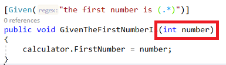
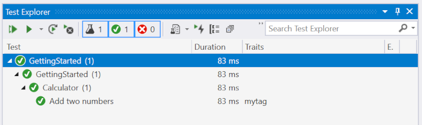

# Getting Started with a New Project

This guide assumes you are working on Windows with Visual Studio.

## Installation and Setup

Installing SpecFlow consists of two steps:

1.  Install the Visual Studio Extension
2.  Set up your Visual Studio project to work with SpecFlow

### Installing the Visual Studio Extension

The SpecFlow extension for Visual Studio provides several helpful features, such as syntax highlighting for Gherkin (feature) files, a Visual Studio project template, and multiple item templates, which help you create executable specifications with SpecFlow. This extension is not required to use SpecFlow, but we recommend you install it if you are using Visual Studio.

To install the extension, download the extension for your version of Visual Studio:

- [Visual Studio 2019](https://marketplace.visualstudio.com/items?itemName=TechTalkSpecFlowTeam.SpecFlowForVisualStudio)
- [Visual Studio 2017](https://marketplace.visualstudio.com/items?itemName=TechTalkSpecFlowTeam.SpecFlowforVisualStudio2017)
- [Visual Studio 2015](https://marketplace.visualstudio.com/items?itemName=TechTalkSpecFlowTeam.SpecFlowforVisualStudio2015)

Either choose to open the download directly, or double-click the extension once it has downloaded to install it in Visual Studio.  

### Setting up your SpecFlow Project

This section guides you through the first steps of setting up a SpecFlow project within Visual Studio and defining and executing your first test scenario. In this example, we will be using [SpecFlow+ Runner](https://www.specflow.org/plus/), but you can use several other test execution frameworks, including NUnit, xUnit, or MSTest.  

**SpecFlow+ Runner is available free of charge.** Learn more about [how to sign-up for your free account](https://specflow.org/2020/introducing-the-specflow-account/). After the successful sign-up, you can execute your scenarios for the first time.

SpecFlow tests are usually placed into one or more separate projects in your solution, and these projects are referred to as a “specification project” below. The easiest and most convenient way to set up these projects is to use the SpecFlow project template provided by our SpecFlow for Visual Studio extension.

To set up your specification project:

1. In Visual Studio, create a new project and search for `SpecFlow`  

   
1. Select `SpecFlow Project` and press `Next`
1. Enter your project name and location and press `Create`

   
1. Configure your .NET version and unit test framework and press `Create`  

   
1. The project is created with all required NuGet packages  

   
1. All NuGet packages for the newly created SpecFlow project should be automatically restored. If not, do a manual restore.
p
**Note:** Your project folder should not be too deep in the filesystem, as you will get problems with Windows 255 character limit in file paths.

#### SpecRun.SpecFlow Package

This package is added to your project automatically when creating the project using the SpecFlow Visual Studio project template with default settings or by manually installing. This package configures SpecFlow+ Runner as your unit test provider.

**Note:** Instead of SpecFlow+ Runner, you can also use [other unit test providers](../Installation/Unit-Test-Providers.md), like MsTest, xUnit or NUnit. Simply choose a different Test Framework than `SpecFlow+ Runner`. However, to follow all the steps in this guide, you need to install SpecFlow+ Runner.

#### Microsoft.NET.Test.Sdk

This package is required for all .NET test projects.

## Your First Feature File

We have already added your first Feature file in order to help you get started. 


The Feature File includes a default scenario written in [Gherkin](../Gherkin/Gherkin-Reference.md) for adding two numbers.  

```gherkin

Feature: Calculator
    In order to avoid silly mistakes
    As a math idiot
    I want to be told the sum of two numbers

@mytag
Scenario: Add two numbers
    Given the first number is 50
    And the second number is 70
    When the two numbers are added
    Then the result should be 120
```

We will use this scenario to demonstrate the first development iteration.  

To add further Feature Files to your project, please take a look at our [Item- Templates](../Installation/Project-and-Item-Templates.html#item-template).  

**Note:** If you are new to BDD/ATDD and Specification-by-Example, we suggest continue reading up on best practices for writing your tests. Learn more about [how to write your specifications in Gherkin](https://specflow.org/2017/fit-for-purpose-gherkin/).

### Your First Step Definitions

Our SpecFlow project template, also includes your first [step definitions](../Bindings/Step-Definitions.md) for the Feature File in the previous section.


``` csharp
using TechTalk.SpecFlow;

namespace GettingStarted.Steps
{
    [Binding]
    public sealed class CalculatorStepDefinitions
    {

        // For additional details on SpecFlow step definitions see https://go.specflow.org/doc-stepdef

        private readonly ScenarioContext _scenarioContext;

        public CalculatorStepDefinitions(ScenarioContext scenarioContext)
        {
            _scenarioContext = scenarioContext;
        }

        [Given("the first number is (.*)")]
        public void GivenTheFirstNumberIs(int number)
        {
            //TODO: implement arrange (precondition) logic
            // For storing and retrieving scenario-specific data see https://go.specflow.org/doc-sharingdata
            // To use the multiline text or the table argument of the scenario,
            // additional string/Table parameters can be defined on the step definition
            // method. 

            _scenarioContext.Pending();
        }

        [Given("the second number is (.*)")]
        public void GivenTheSecondNumberIs(int number)
        {
            //TODO: implement arrange (precondition) logic
            // For storing and retrieving scenario-specific data see https://go.specflow.org/doc-sharingdata
            // To use the multiline text or the table argument of the scenario,
            // additional string/Table parameters can be defined on the step definition
            // method. 

            _scenarioContext.Pending();
        }

        [When("the two numbers are added")]
        public void WhenTheTwoNumbersAreAdded()
        {
            //TODO: implement act (action) logic

            _scenarioContext.Pending();
        }

        [Then("the result should be (.*)")]
        public void ThenTheResultShouldBe(int result)
        {
            //TODO: implement assert (verification) logic

            _scenarioContext.Pending();
        }
    }
}
```

To add further step definitions to your project, please take a look at [how to create step definitions skeleton code](../Tools/Generating-Skeleton-Code.md).

## Executing your First Test

The next step is to build the solution. After that, the business readable scenario titles will show up in Visual Studio Test Explorer:

1. Build your solution.
1. Select **Test | Windows | Test Explorer** to open the Test Explorer:  

     

   Scenarios are displayed with their plain text scenario title instead of a generated unit test name.
1. Click on **Run All** to run your test.
1. You will be asked to sign up for a [SpecFlow account](https://specflow.org/2020/introducing-the-specflow-account/) or to sign in with your existing account.  
   To see the output of the SpecFlow+ Runner please open the “Output” pane and select “Tests” in the “Show output from” dropdown:  

   

1. Open the URL in the message in your browser. In Visual Studio you can click the link while pressing the CTRL-key.
1. You are displayed with a “Welcome Page”. Click on **Sign in with Microsoft** to continue.
1. Sign in with your Microsoft account. It can be a personal or corporate/enterprise account. If you are already signed in, this should happen automatically – _you might need additional permissions from your Active Directory admin. [Learn more about admin consents](https://docs.microsoft.com/en-us/azure/active-directory/manage-apps/configure-admin-consent-workflow)_
1. You will be taken to a setup page where you can set up your SpecFlow account. Enter your details to sign up for a free SpecFlow account.
1. Return to Visual Studio and click on “**Run all**” again.
1. As the automation and application code has not yet been implemented, the test will not pass successfully.

**Note:** If you cannot see your tests, make sure there are no spaces or dashes in your project name!

## Implementing the Automation and Application Code

In order for your tests to pass, you need to implement both the application code (the code in your application you are testing) and the automation code (binding the test scenario to the automation interface). This involves the following steps, which are covered in this section:

1. Reference the assembly or project containing the interface you want to bind the automation to (including APIs, controllers, UI automation tools, etc.).
2. Extend the step definition skeleton with the automation code.
3. Implement the missing application code.
4. Verify that the scenario passes the test.

### Adding a Calculator Class

The application code that implements the actual functions performed by the calculator should be defined in a separate project from your specification project. This project should include a class for the calculator and expose methods for initializing the calculator and performing the addition:

1. Right-click on your solution in the Solution Explorer and select **Add | Project** from the context menu. Choose to add a new class library and give your project a name (e.g. “Example”).
2. Right-click on the .cs file in the new project and rename it (e.g. “Calculator.cs”), and choose to rename all references.
3. Your new class should be similar to the following:

   ```csharp
   using System;
   using System.Collections.Generic;
   using System.Linq;
   using System.Text;
   using System.Threading.Tasks;

   namespace Example
   {
       public class Calculator
       {

       }
   }
   ```

### Referencing the Calculator Class

1. Right-click your specification project and select **Add | Reference** from the context menu.
2. Click on **Projects** on the left of the **Reference Manager** dialogue. The projects in your solution are listed.
3. Enable the checkbox next to the **Example** project to reference it from the specifications project.
4. Click on **OK**.  
   A reference to the **Example** project is added to the **References** node in the **Solution Explorer**.
5. Add a using directive for the namespace (e.g. “Example”) of your Calculator class to the CalculatorStepDefinitions.cs file in your specification project:

```csharp
    using Example;
```

6. Define a variable of the type Calculator in the CalculatorStepDefinitions class before the step definitions:

```csharp
    public class CalculatorStepDefinitions
    {
        private Calculator calculator = new Calculator();
        
        [Given("the first number is (.*)")]
        public void GivenTheFirstNumberIs(int number)
        {
            calculator.FirstNumber = number;
        }

        //more code ...
    }
```

Defining a variable outside of the individual steps allows the variable to be accessed by each of the individual steps and ensures the variable is persistent between steps.

### Implementing the Code

Now that the step definitions can reference the **Calculator** class, you need to extend the step definitions and implement the application code.

#### Binding the First Given Statement

The first Given statement in the scenario needs to initialize the calculator with the first of the two numbers defined in the scenario (50). To implement the code:

1. Open CalculatorStepDefinitions.cs if it is not already open.  
   The value defined in the scenario is passed as a parameter in the automation code’s associated function, e.g.:  

    
    
2. Rename this parameter to something more human-readable (e.g. “number”):

```csharp
    [Given("the first number is (.*)")]
    public void GivenTheFirstNumberIs(int number)
```

3. To initialize the calculator with this number, replace `_scenarioContext.Pending();` in the step definition as follows:

```csharp
    [Given("the first number is (.*)")]
    public void GivenTheFirstNumberIs(int number)
    {
        calculator.FirstNumber = number;
    }
```

4. Switch to the file containing your **Calculator** class (e.g. Calculator.cs) and add a public integer member to the class:

```csharp
    public int FirstNumber { get; set; }
```

You have now determined that the FirstNumber member of the **Calculator** class is initialized with the value defined in the scenario when the test is executed.

#### Binding the Second Given Statement

The second Given statement in the scenario needs to initialize the second number with the second value defined in the scenario (70). To implement the code:

1. Open CalculatorStepDefinitions.cs if it is not already open.
2. Locate the function corresponding to the second Given statement and rename the p0 parameter to “number”, as before.
3. To initialize the calculator with the second number, replace `_scenarioContext.Pending();` in the step definition as follows:

```csharp
    [Given("the second number is (.*)")]
    public void GivenTheSecondNumberIs(int number)
    {
        calculator.SecondNumber = number;
    }
```

4. Switch to the file containing your **Calculator** class and add another public integer member to the class:

```csharp
    public int SecondNumber { get; set; }
```

You have now determined that the SecondNumber member of the **Calculator** class is initialized with the value defined in the scenario when the test is executed.

#### Binding the When Statement

The step for the When statement needs to call the method that performs the actual addition and store the result. This result needs to be available to the other final step in the automation code in order to verify that the result is the expected result defined in the test scenario.

To implement the code:

1. Open CalculatorStepDefinitions.cs if it is not already open.
2. Define a variable to store the result at the start of the CalculatorSeps class (before any of the steps):

```csharp
    private int result;
```

Defining a variable outside of the individual steps allows the variable to be accessed by each of the individual steps.

3. Locate the function corresponding to the When statement and edit it as follows:

```csharp
    [When("the two numbers are added")]
    public void WhenTheTwoNumbersAreAdded()
    {
        result = calculator.Add();
    }
```

4. Switch to the file containing your **Calculator** class and define the Add() method:

```csharp
    public int Add()
    {
        return FirstNumber + SecondNumber;
    }
```

You have now determined that the Add() method of the calculator class is called once the initial Given steps have been performed.

#### Binding the Then Statement

The step for the Then statement needs to verify that the result returned by the **Add()** method in the previous step is the same as the expected result defined in the test scenario. To implement the code:

1. Open CalculatorStepDefinitions.cs if it is not already open.  
   As the result will be verified using Assert, you need to add “using Microsoft.VisualStudio.TestTools.UnitTesting;” to the top of your automation code.
2. Locate the function corresponding to the Then statement. Rename the p0 parameter in the function call (this time to “expectedResult”) and edit the step definition as follows:

```csharp
    [Then("the result should be (.*)")]
    public void ThenTheResultShouldBe(int result)
    {
        Assert.AreEqual(expectedResult, result);
    }
```

You have now implemented the final piece of the jigsaw – testing that the result returned by your application matches the expected result defined in the scenario.

### Final CalculatorStepDefinitions.cs Code

Your CalculatorStepDefinitions.cs code should be similar to the following:

```csharp
using TechTalk.SpecFlow;

namespace GettingStarted.Steps
{
    [Binding]
    public sealed class CalculatorStepDefinitions
    {
        private readonly ScenarioContext _scenarioContext;

        private int result;
        private Calculator calculator = new Calculator();

        public CalculatorStepDefinitions(ScenarioContext scenarioContext)
        {
            _scenarioContext = scenarioContext;
        }

        [Given("the first number is (.*)")]
        public void GivenTheFirstNumberIs(int number)
        {
            calculator.FirstNumber = number;
        }

        [Given("the second number is (.*)")]
        public void GivenTheSecondNumberIs(int number)
        {
            calculator.SecondNumber = number;
        }

        [When("the two numbers are added")]
        public void WhenTheTwoNumbersAreAdded()
        {
            result = calculator.Add();
        }

        [Then("the result should be (.*)")]
        public void ThenTheResultShouldBe(int result)
        {
            Assert.AreEqual(expectedResult, result);
        }
    }
}
```

### Final Calculator.cs Code

Your Calculator.cs code should be similar to the following:

```csharp
    using System;
    using System.Collections.Generic;
    using System.Linq;
    using System.Text;
    using System.Threading.Tasks;

    namespace Example
    {
        public class Calculator
        {
        public int FirstNumber { get; set; }
        public int SecondNumber { get; set; }

            public int Add()
            {
                return FirstNumber + SecondNumber;
            }
        }
    }
```

## Executing the Tests Again

Now that the test steps have been bound to your application code, you need to rebuild your solution and execute the tests again (click on **Run All** in the Test Explorer). You should see that the test now passes (green).


Click on **Output** in the Test Explorer to display a summary of the test:  
  
This example is very simple; at this point, you would want to refactor your code before proceeding with the implementation of your remaining scenarios.

### SpecFlow+ Runner Sample Projects

Many SpecFlow+ Runner sample projects, including the project covered in this tutorial ([Getting Started](https://github.com/SpecFlowOSS/SpecFlow.Plus.Examples/tree/master/Getting_Started)), can be found [on GitHub.](https://github.com/SpecFlowOSS/SpecFlow.Plus.Examples)

You can find samples using other unit test providers also [on GitHub](https://github.com/SpecFlowOSS/SpecFlow-Examples).

### SpecFlow+ Runner Advanced Features

Learn about the [Advanced features SpecFlow+ Runner has to offer](https://specflow.org/plus/runner/advanced-features/).

### Other Unit Test Providers

Instead of [SpecFlow+ Runner](https://specflow.org/plus/runner/), you can also use [other unit test providers](https://specflow.org/documentation/Unit-Test-Providers/), like MsTest, xUnit, or NUnit. These packages are installed in the same manner as SpecFlow+ Runner. However, to follow all the steps in this guide, you need to install SpecFlow+ Runner.

## Living Documentation

To get the most out of SpecFlow and providing the basis for further discussions about the behavior of your system, we recommend to share your Feature Files with all your stakeholders and team members. 

An easy way to share your Feature Files is to use the **free** [SpecFlow+ LivingDoc extension](https://marketplace.visualstudio.com/items?itemName=techtalk.techtalk-specflow-plus) to generate a living documentation from your Feature Files.

This documentation can then be accessed from within Azure DevOps without the need for Visual Studio. Your Gherkin tests constitute an important part of the documentation of your system, describing the intended behavior in human-readable form and providing the basis for discussion with other project stakeholders.

Many stakeholders will not be able to access your Feature Files directly in your repository, nor will they be using Visual Studio, so sharing them on a common platform is a big advantage. [Learn more about SpecFlow+ LivingDoc](https://specflow.org/plus/livingdoc/).
