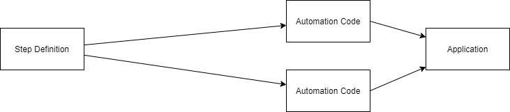
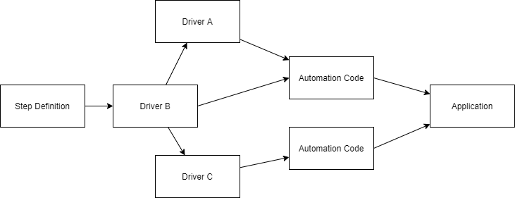

# Driver Pattern

The Driver Pattern is simply an additional layer between your step definitions and your automation code.

Over the years, we noticed that a good practice to organize your bindings and automation code is to keep the code in the bindings very short (around 10 lines) and easy understandable.  

This gives you following benefits:

- easier to maintain your test automation code  
  As you split your code into multiple parts, it gets easier to maintain
- easy to reuse methods in different step definitions or combine multiple steps into a single step  
  We often see, a group of steps that are in a lot of Scenarios. As you have now the automation code in separate classes, chaining the method calls is really easy.
- easier to read step definitions  
  This makes it possible, that also non- technical people can understand what is happening in a step definition. This makes your life in bigger projects easier, because nobody will remember what every single step is doing.  

The Driver pattern is heavily using [Context- Injection](../Bindings/Context-Injection.md) to connect the multiple classes together.

## Example

In this example you see how the code looks before and after refactoring with the Driver pattern.

**Before**:

This is some automation code that uses the [Page Object Model](PageObjectModel.md) and checks if some WebElements are existing.  

``` csharp
[Then(@"it is possible to enter a '(.*)' with label '(.*)'")]
public void ThenItIsPossibleToEnterAWithLabel(string inputType, string expectedLabel)
{
    var submissionPageObject = new SubmissionPageObject(webDriverDriver);

    switch (inputType.ToUpper())
    {
        case "URL":
            submissionPageObject.UrlWebElement.Should().NotBeNull();
            submissionPageObject.UrlLabel.Should().Be(expectedLabel);
            break;
        case "TYPE":
            submissionPageObject.TypeWebElement.Should().NotBeNull();
            submissionPageObject.TypeLabel.Should().Be(expectedLabel);
            break;
        default:
            throw new NotImplementedException(inputType + " not implemented");
    }
}
```



**After**:

With moving the automation code into a driver class, we could reduce the number of lines in the step definition to one. Also we can now use a method-name (`CheckExistenceOfInputElement`), that is understandable by everybody in your team.

To get an instance of the driver class (`SubmissionSteps`), we are using the [Context- Injection](../Bindings/Context-Injection.md) Feature of SpecFlow.

``` csharp
[Binding]
public class SubmissionSteps
{
    private readonly SubmissionPageDriver submissionPageDriver;

    public SubmissionSteps(SubmissionDriver submissionDriver)
    {
        this.submissionPageDriver = submissionPageDriver;
    }

    [Then(@"it is possible to enter a '(.*)' with label '(.*)'")]
    public void ThenItIsPossibleToEnterAWithLabel(string inputType, string expectedLabel)
    {
        submissionPageDriver.CheckExistenceOfInputElement(inputType, expectedLabel);
    }

    // ...
```

``` csharp
public class SubmissionPageDriver
{
    // ...

    public void CheckExistenceOfInputElement(string inputType, string expectedLabel)
    {
        var submissionPageObject = new SubmissionPageObject(webDriverDriver);

        switch (inputType.ToUpper())
        {
            case "URL":
                submissionPageObject.UrlWebElement.Should().NotBeNull();
                submissionPageObject.UrlLabel.Should().Be(expectedLabel);
                break;
            case "TYPE":
                submissionPageObject.TypeWebElement.Should().NotBeNull();
                submissionPageObject.TypeLabel.Should().Be(expectedLabel);
                break;
            default:
                throw new NotImplementedException(inputType + " not implemented");
        }
    }

    // ...
```



## Further Resources

- <http://leitner.io/2015/11/14/driver-pattern-empowers-your-specflow-step-definitions>
