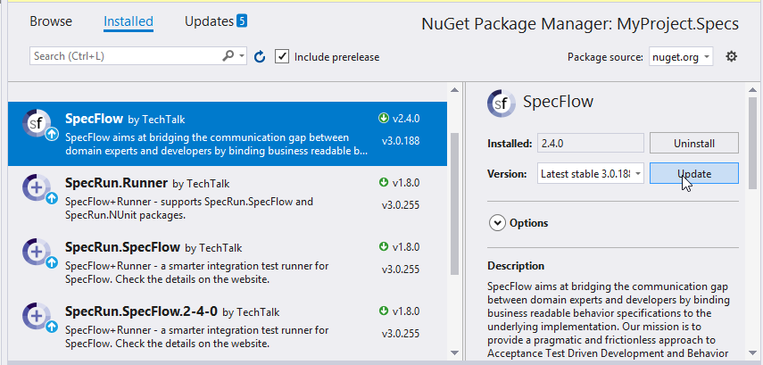

# Upgrade from SpecFlow 2.* to 3.*

This guide explains how to update your SpecFlow 2.* project to the latest SpecFlow 3.* version

## Make a Backup!

Before upgrading to the latest version, ensure you have a backup of your project (either locally or in a source control system).

## Visual Studio Integration

The Visual Studio integration for SpecFlow has been updated for SpecFlow 3. You will need to update the extension in order to upgrade. If you previously set the extension to not update automatically, please enable automatic upgrades once your projects have been migrated to SpecFlow 2.3.2 or higher.

## App.config Deprecated

### Changes to How Unit Test Providers are Configured

In previous versions of SpecFlow, the unit test provider used to execute tests was configured in your app.config file. As of SpecFlow 3, you need to configuring your unit test provider by installing one of the available packages (see below).

### specflow.json

Moving forward, we recommend using specflow.json to configure SpecFlow, rather than app.config. .NET Core projects require specflow.json (app.config is not supported). While using specflow.json is optional for Full Framework projects, we recommend migrating to the new format. For more details, see [Configuration](../Installation/Configuration.md) in the documentation.

## Updating SpecFlow

To upgrade a solution from SpecFlow 2.x to SpecFlow 3:

1. Open your solution, and check that it compiles, all tests are discovered and that all source files have been committed.
1. Right-click on your solution and select Manage NuGet Packages for Solution.
1. Switch to Updates in the list on the left and locate SpecFlow in the list of packages. Use the search box to restrict the listed packages if necessary.

1. Select the SpecFlow package in the list and click on Update.
1. Add one of the following packages to your specifications project (the one containing your tests) to select your unit test provider. You will receive an error if you add more than one of these packages to your project:

    - SpecRun.SpecFlow
    - SpecFlow.xUnit
    - SpecFlow.MsTest
    - SpecFlow.NUnit  

1. Remove “SpecFlowSingleFileGenerator” from the Custom Tool field in the Properties of your feature files.

## Updating SpecFlow+ Runner

If you want to update both SpecFlow and SpecFlow+ Runner to version 3, the easiest way to do this is to simply upgrade the SpecRun package. This automatically updates SpecFlow as well.

To update SpecFlow and SpecFlow+ Runner:

1. Open your solution, and check that it compiles, all tests are discovered and that all source files have been committed.
1. Right-click on your solution and select Manage NuGet Packages for Solution.
1. Uninstall any SpecRun.SpecFlow.*-*-* packages you have installed.
1. Install/update the following packages:
    - SpecFlow
    - SpecRun.SpecFlow
1. Remove “SpecFlowSingleFileGenerator” from the Custom Tool field in the Properties of your feature files.

### SpecFlow+ Runner Report Templates

If you have customized the SpecFlow+ runner templates, a small change needs to be made to the template for SpecFlow 3:

Open the CSHTML file in the editor of your choice.
Replace the first line with the following:

``` xml
@inherits SpecFlow.Plus.Runner.Reporting.CustomTemplateBase<TestRunResult>
```

