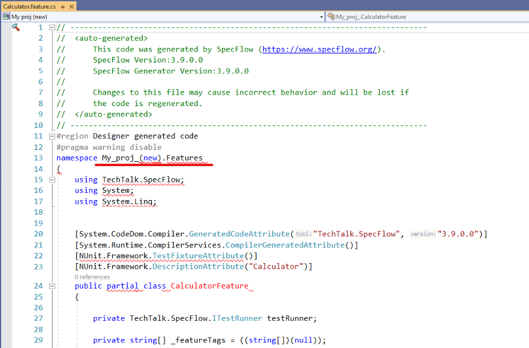
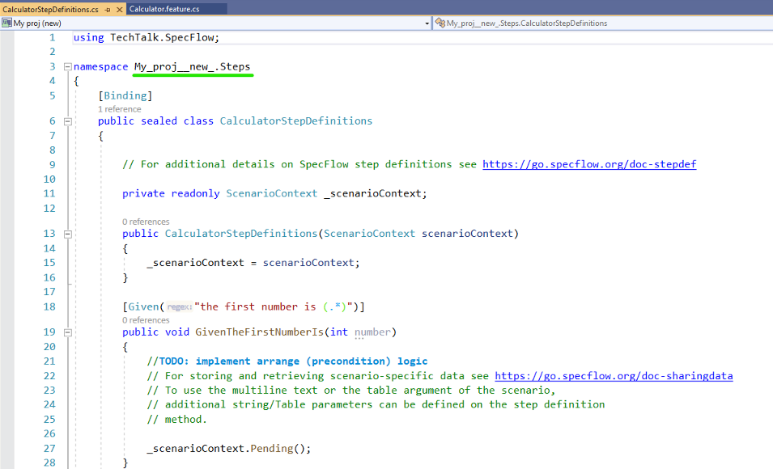
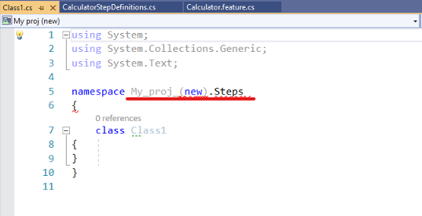
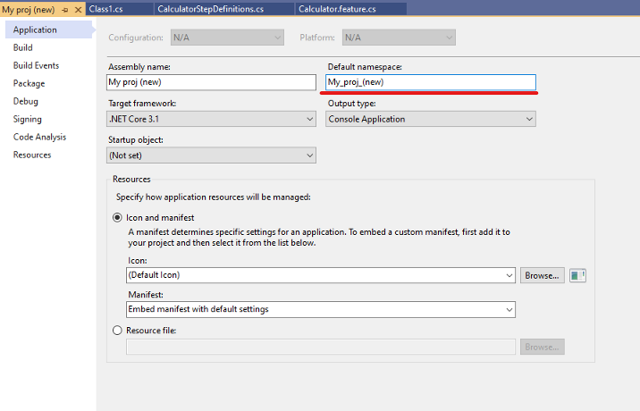
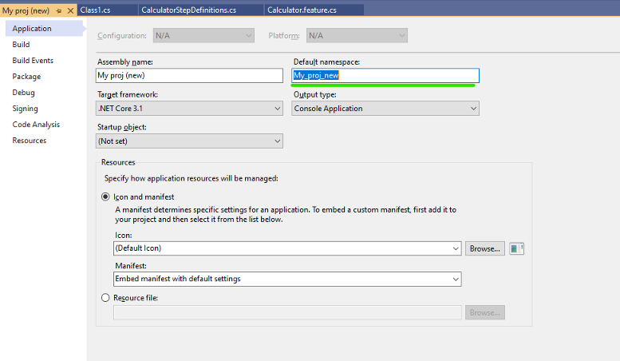
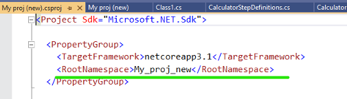
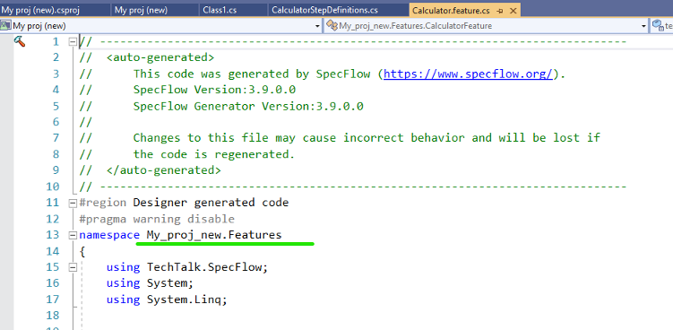

# Troubleshooting

## Cannot find custom tool SpecFlowSingleFileGenerator

If Visual Studio displays the error message `Cannot find custom tool 'SpecFlowSingleFileGenerator' on this system.` when right-clicking on a feature file and selecting `Run Custom Tool`, make sure the SpecFlow extension is installed and enabled.

To enable the extension in Visual Studio, select **Tools | Extensions and Updates...**, select the "SpecFlow for Visual Studio" extension, then select **Enable**.

## Enabling Tracing

You can enable traces for SpecFlow. Once tracing is enabled, a new `SpecFlow` pane is added to the output window showing diagnostic messages. 

To enable tracing, select **Tools | Options | SpecFlow** from the menu in Visual Studio and set **Enable Tracing** to 'True'. 

### Steps are not recognised even though there are matching step definitions
  
The SpecFlow Visual Studio integration caches the binding status of step definitions. If the cache is corrupted, steps may be unrecognised and the highlighting of your steps may be wrong (e.g. bound steps showing as being unbound). To delete the cache:

1. Close all Visual Studio instances.
2. Navigate to your `%TEMP%` folder and delete any files that are prefixed with `specflow-stepmap-`, e.g. `specflow-stepmap-SpecFlowProject-607539109-73a67da9-ef3b-45fd-9a24-6ee0135b5f5c.cache`.
3. Reopen your solution.

You may receive a more specific error message if you enable tracing (see above).

### Tests are not displayed in the Test Explorer window when using SpecFlow+ Runner 
**Note:** As of Visual Studio 2017 15.7 the temporary files are no longer used. The following only applies to earlier versions of Visual Studio.

The Visual Studio Test Adapter cache may also get corrupted, causing tests to not be displayed. If this happens, try clearing your cache as follows:

1. Close all Visual Studio instances
2. Navigate to your `%TEMP%\VisualStudioTestExplorerExtensions\` folder and delete any sub-folders related to SpecFlow/SpecRun, i.e. that have "SpecFlow" or "SpecRun" in their name.
3. Reopen your solution and ensure that it builds.

### Unable to find plugin in the plugin search path: SpecRun` when saving / generating feature files

SpecFlow searches for plugins in the NuGet packages folder. This is detected relative to the reference to `TechTalk.SpecFlow.dll`. If this DLL is not loaded from the NuGet folder, the plugins will not be found. 

A common problem is that the NuGet folder is not yet ready (e.g. not restored) when opening the solution, but `TechTalk.SpecFlow.dll` in located in the `bin\Debug` folder of the project. In this case, Visual Studio may load the assembly from the `bin\Debug` folder instead of waiting for the NuGet folder to be properly restored. Once this has happened, Visual Studio remembers that it loaded the assembly from `bin\Debug`, so reopening the solution may not solve this issue. The best way to fix this issue is as follows:

1. Make sure the NuGet folders are properly restored.
2. Close Visual Studio.
3. Delete the `bin\Debug` folder from your project(s).
4. Reopen your solution in Visual Studio.

### Tests are not displayed in the Test Explorer window when using SpecFlow+ Runner, even after after restoring the NuGet package

The `SpecRun.Runner` NuGet package that contains the Visual Studio Test Explorer adapter is a solution-level package (registered in the `.nuget\packages.config` file of the solution). In some situations, NuGet package restore on build does not restore solution-level packages. 
   
To fix this, open the NuGet console or the NuGet references dialog and click on the restore packages button. You may need to restart Visual Studio after restoring the packages.

### VS2015: Tests are not displayed in the Test Explorer window when using SpecFlow+ Runner

It seems that VS2015 handles solution-level NuGet packages differently (those registered in the `.nuget\packages.config` file of the solution). As a result, solution-level NuGet packages must be listed in the projects that use them, otherwise Test Explorer cannot recognise the test runner.

To fix this issue, either re-install the SpecFlow+ Runner NuGet packages, or add the dependency on the `SpecRun.Runner` package (`<package id="SpecRun.Runner" version="1.2.0" />`) to the packages.config file of your SpecFlow projects. You might need to restart Visual Studio to see your tests.

## When trying to run my tests in Visual Studio, I receive a Missing [assembly:GeneratorPlugin] attribute error. How can I solve this?

Sample output:
```
Missing [assembly:GeneratorPlugin] attribute in SpecFlow.Plus.Excel.SpecFlowPlugin.dll
#error TechTalk.SpecFlow.Generator
#error Server stack trace:
#error at TechTalk.SpecFlow.Generator.Plugins.GeneratorPluginLoader.LoadPlugin(PluginDescriptor pluginDescriptor)
...
```

If you are receiving this error, try setting the **Generation Mode** in SpecFlow to "OutOfProcess". To do so: 

1. Select **Tools | Options** from the menu in Visual Studio. 
1. Select SpecFlow from the list on the left.
1. Locate the **Generation Mode** setting and set it to "OutOfProcess".


## After upgrading to SpecFlow 2 from 1.9, I get the message "Trace listener failed. -> The ScenarioContext.Current static accessor cannot be used in multi-threaded execution. Try injecting the scenario context to the binding class"

Make sure you have regenerated the `.feature.cs` files after upgrading. If you do not do this, you will receive this exception when accessing `ScenarioContext.Current`.

To regenerate these files:

* Open a feature file in your solution. If you see a popup informing you that the feature files were generated with an earlier version of SpecFlow, click on **Yes** to regenerate these files. Depending on the size of your project, this may take a while.
* If you are using an earlier version of Visual Studio, you need to force the feature files to be regenerated. Right-click on your project, and select **Regenerate Feature Files** from the menu.

## Build error due to using spaces and special characters in project name

Using special characters in your project name will cause build errors as the feature files will fail to generate properly.

The build error may look like this:

`````
Build started...
1>------ Build started: Project: My proj (new), Configuration: Debug Any CPU ------
1>SpecFlowFeatureFiles: Features\Calculator.feature
1>SpecFlowGeneratedFiles: Features\Calculator.feature.cs
1>C:\Work\repros\My proj\My proj (new)\obj\Debug\netcoreapp3.1\NUnit.AssemblyHooks.cs(12,22,12,23): error CS1514: { expected
1>C:\Work\repros\My proj\My proj (new)\obj\Debug\netcoreapp3.1\NUnit.AssemblyHooks.cs(12,22,12,23): error CS1513: } expected
1>C:\Work\repros\My proj\My proj (new)\obj\Debug\netcoreapp3.1\NUnit.AssemblyHooks.cs(12,22,12,27): error CS8400: Feature 'top-level statements' is not available in C# 8.0. Please use language version 9.0 or greater.
1>C:\Work\repros\My proj\My proj (new)\obj\Debug\netcoreapp3.1\NUnit.AssemblyHooks.cs(12,22,12,27): error CS8803: Top-level statements must precede namespace and type declarations.
1>C:\Work\repros\My proj\My proj (new)\obj\Debug\netcoreapp3.1\NUnit.AssemblyHooks.cs(12,26,12,27): error CS1526: A new expression requires an argument list or (), [], or {} after type

.....
`````

The most obvious solution to this is to avoid using **special characters e.g. (paranthesis)** for your project name. Spaces are ok as they get replaced with underlines_.

### Example

If you have already created your project with special characters you can still change that. Lets take a look at an example. The below project name was created as ***My proj (new)***.

- If you open the generated code you can find that although the spaces have been replaced with underscore characters the parentheses are kept in the namespace causing a compilation error. Visual Studio also highlights this invalid code.



- If you use the SpecFlow project template there is also a binding class added already to the project. In the C# file the generated namespace is correct, because the parentheses are also automatically replaced with underscore:



- However, you can see that the project is generally in an "unhealthy state" if you try to add a new C# file from Visual Studio. The new file will have a similar invalid namespace like the SpecFlow generated code:



- This is caused by the default namespace of the project (go to project properties in Visual Studio). By default the root namespace equals to the project name (equals to the assembly name). However, while the parenthesis are valid in the project name and in the assembly name, these characters are not valid in the namespace. Note that the spaces are automatically replaced with underscore, but the parentheses are not:



### Solution

- To fix the project the default namespace should be changed to a valid namespace:



- You can also fix the issue in the csproj file directly. The property "RootNamespace" has to be set accordingly:



- The default namespace will be applied by SpecFlow code generation and the generated classes will be valid now:



***> Note:** if you added a C# class with the invalid default namespace you have to fix that file manually. This is the standard behavior of the default namespace, it will be used for newly created files only.
The SpecFlow generated classes get however automatically fixed, because they are (re-)generated during the build.*