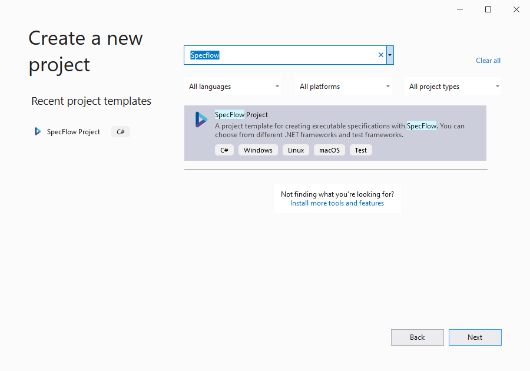
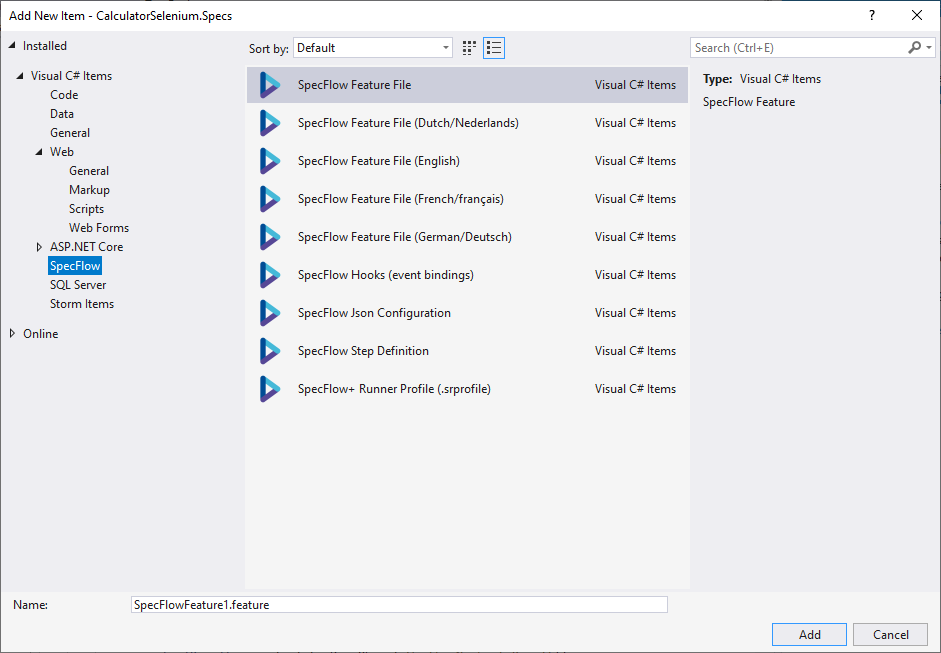

# Project and Item Templates

## Visual Studio Templates

It is required to have the [SpecFlow Visual Studio Extension](Installation.md) installed.

### Project Template

You can find the `SpecFlow Project` in the `New project` dialog, when you search for `SpecFlow`.  

After the normal configuration of your project (location, name, ...), you will get to a step to choose your .NET version and test framework for the new project.  

Clicking on `Next` will create you a new project with all required NuGet packages:  

### Item Template

We provide various item templates:

## .NET CLI Templates

**Note:** The [.NET Core SDK](https://dotnet.microsoft.com/download) is required to be installed in order to use project templates.

* **SpecFlow Feature File**: Gherkin Feature file with an example
* **SpecFlow Feature File (Dutch/Nederlands)**: empty Gherkin feature file in dutch
* **SpecFlow Feature File (English)**: empty Gherkin feature file in english
* **SpecFlow Feature File (French/français)**: empty Gherkin feature file in french
* **SpecFlow Feature File (German/Deutsch)**: empty Gherkin feature file in german
* **SpecFlow Hooks (event bindings)**: template class with `BeforeScenario` and `AfterScenario` hooks
* **SpecFlow Json Configuration**: template for `specflow.json`
* **SpecFlow Step Definition**: step definitions class
* **SpecFlow+ Runner Profile (.srProfile)**: configuration file for SpecFlow+ Runner

### Installing the Project Template

To install the project template:

1. Open the command line interface of your choice (e.g. cmd or powershell).
1. Execute the following command:  
  `dotnet new -i SpecFlow.Templates.DotNet`
1. The template is installed locally. Once the installation is complete, you can use the template to create new SpecFlow projects.

### Creating a New Project from the Template

After installing the templates, you can create a new project using the following command:

`dotnet new specflowproject`

By default, a .NET Core project is created with SpecFlow+ Runner configured as the test runner. You can create a project for a different test runner and/or target framework using the following optional parameters:

* `framework`: Determine the target framework for the project. The following options are available:
  *  `netcoreapp3.0` (default): .NET Core 3.0
  *  `netcoreapp3.1` (default): if .NET Core 3.1 is installed (presence of Core 3.x is mutual exklusive)
  *  `netcoreapp2.2`: .NET Core 2.2
  *  `net472`: .NET Framework 4.72
* `unittestprovider`: Determines the test runner. The following options are available:
  * `specflowplusrunner` (default): SpecFlow+ Runner
  * `xunit`: XUnit
  * `nunit`: NUnit
  * `mstest`: MSTest

**Example:**
`dotnet new specflowproject --unittestprovider xunit --framework netcoreapp2.2`

This creates a new project with XUnit as the unit test provider, and targetting .NET Core 2.2. The project is created with a pre-defined structure that follows best practices. The project includes a single feature file (in the `Features` folder) and its associated steps (in the `Steps` folder).

### Item Templates

The template pack also includes a few item templates:

* `specflow-feature`: .feature file in English
* `specflow-json`: specflow.json configuration file
* `specflow-plus-profile`: Default.srProfile (SpecFlow+Runner configuration)

If you have additional ideas for the templates, please open a GitHub issue <a href="https://github.com/techtalk/SpecFlow/issues">here</a>.
