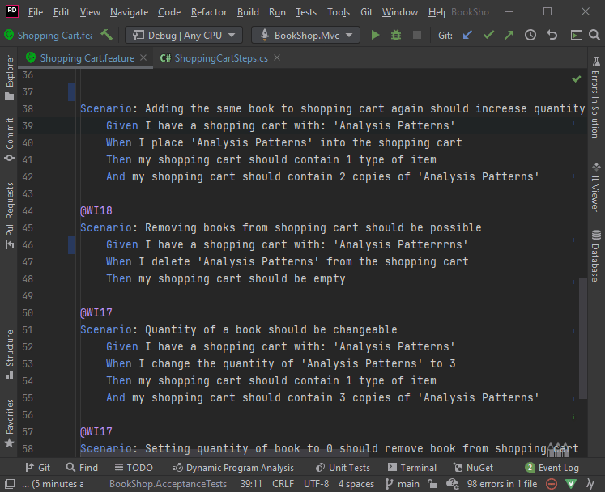

# Features

The SpecFlow for Rider plugin is bundled with a handful of features, see below for more details.

## Navigation

The SpecFlow for Rider plugin allows you to quickly navigate between a Gherkin Step, its relevant bindings, and vice versa.

There are multiple ways to achieve this:

***>Note** The keyboard shortcuts documented below may vary depending on how they were setup during the Rider installation. This documentation is based off the Visual Studio shortcut schema. More info [here](https://www.jetbrains.com/help/rider/Reference_Keymap_VS.html)*.

1- The quickest way to navigate from a Gherkin step to its relevant binding is to use keyboard shortcuts **(Ctrl + F12)**. Alternatively, you can right click on a Gherkin step and navigate to ***Go to ➡ Implementations*** :

2- To navigate from a binding to its corresponding Gherkin step, the keyboard shortcuts **(Shift + F12)** can be used :

3- You can also see all Gherkin steps currently using a particular binding by pressing **F12** or by navigating to it ***Go to ➡ Go to Declarations or Usages*** :

## Creating Steps

The plugin allows you to quickly create a step and also highlights when a step is missing. To do this, click on an unbound step, click on view action list, and then click on *Create step*:

### Create a New Binding Class

You also have the option to create a new binding class straight from the *Create step* menu. To do this, click on an unbound step, click on view action list, and then click on *Create step* and then navigate to *Create new binding class*:

## Test Results

The SpecFlow plugin also displays the test results for a specific Gherkin step. You can see whether a test has passed or failed and also execute it by pressing the **⏵** button:

### Failed Tests Results

If a test fails, the plugin shows you the exact step at which the step failed by highlighting it and also conveniently displays the error message at feature file level. You can view this by hovering over the SpecFlow logo on the failed step:

## Auto Renaming

The plugin also automatically detects any mismatch in step definition names and displays suggestions to match it to its pattern:

## Syntax Highlighting

Syntax highlighting helps you quickly identify unbound steps in your feature files by underlining them:

The absence of a red underline indicates that the step is bound. Notice the parameters in bound steps are also colored differently, in this example light grey.

*> Note: Syntax highlighting colors may vary depending on your Rider theme.*

## Table Formatting

Tables are expanded and formatted automatically in feature files. You can use the keyboard shortcuts  **(Ctrl + Alt + Enter)** or go to ***Code ➡ Reformat Code*** to apply correct formatting on the entire feature file.

📄 Please note we are always working to improve and introduce new features to make the plugin more versatile and easy to use.
