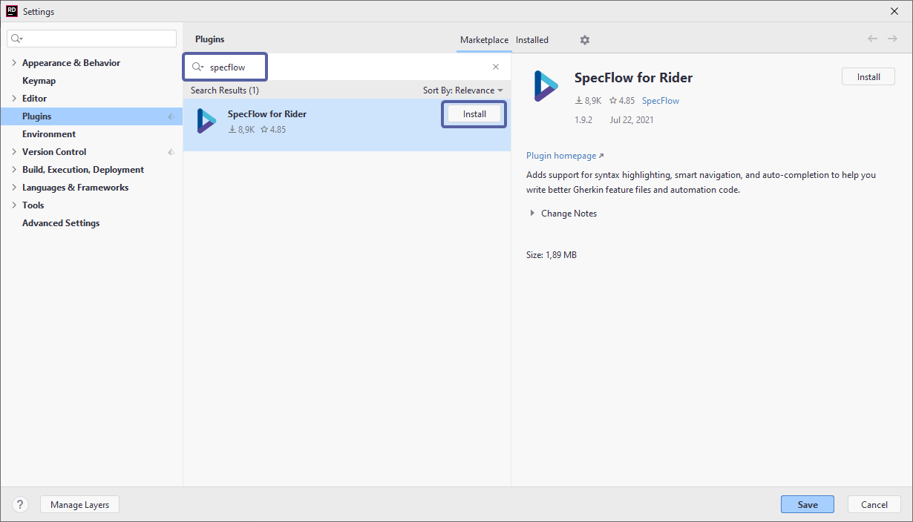
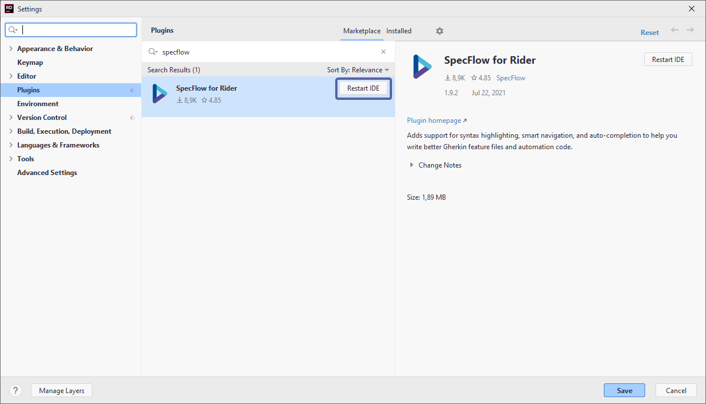

# Installation

The SpecFlow for Rider plugin can be found either at the [JetBrains marketplace](https://plugins.jetbrains.com/plugin/15957-specflow-support) or directly from within the Rider IDE.

To install the plugin directly from JetBrains Rider:

**1-** Open JetBrains Rider

**2-** Navigate to ***File ➡ Settings ➡ Plugins (Ctrl+Alt+S)*** and search for “SpecFlow” in the search bar:

**3-** Hit ***Install*** and then ***Accept*** when prompted with the privacy note. You can find our privacy policy [here](https://specflow.org/privacy-policy/)

**4-** You are then required to restart the Rider IDE, hit ***Restart***:

The installation is now finished. Check out the [SpecFlow for Rider features](../Rider/rider-features.md) to see a list of all the handy features in this plugin.