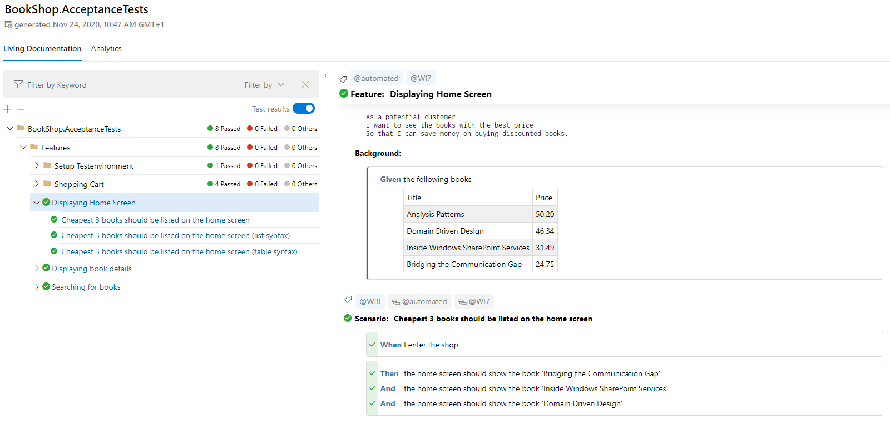

# Reporting

## SpecFlow+ LivingDoc

Reporting is now easier to generate and share thanks to SpecFlow+ LivingDoc.

You can see your test execution results in a dynamic way now and also check for any [unused step definitions](https://docs.specflow.org/projects/specflow-livingdoc/en/latest/LivingDocGenerator/Unused-step-definition-report.html) along with many other handy features that truly bring your reporting and documentation to life!

**Head over to [SpecFlow+ LivingDoc](https://docs.specflow.org/projects/specflow-livingdoc/en/latest/) to read more.**

Here is a quick snapshot:



## Reporting prior to SpecFlow 3

**These reports are only available prior to SpecFlow 3! They have been removed in SpecFlow 3.**

SpecFlow provides various options to generate reports related to the acceptance tests.

**Note:** The `specflow.exe` [command line tool](Tools.md) that is used to generate reports can be found in the `packages\Specflow.{version number}\tools` directory, when you installed SpecFlow through NuGet. Start the tool with no parameters or use the `--help` option to display an overview of the available options.

You can find a repository containing the old report code [here](https://github.com/techtalk/SpecFlow.Reports). For information on why the reports were moved to a seperate repo, please read see this [GitHub issue](https://github.com/techtalk/SpecFlow/issues/1036).

### Test Execution Report

This report generates an HTML test execution report. The report contains a summary of the executed tests and their results, as well as a detailed report of the execution of individual scenarios. 

The following sub-sections cover generating the test execution report for different unit test providers.

### NUnit Test Execution Report

#### NUnit 2
In order to generate this report, execute the acceptance tests with the `nunit-console` runner. This tool generates an XML summary of the test executions. To include detailed scenario execution traces, you need to capture the test output using the `/out` and the `/labels` options, e.g.

```
nunit-console.exe /labels /out=TestResult.txt /xml=TestResult.xml bin\Debug\BookShop.AcceptanceTests.dll
```

#### NUnit 3

In order to generate this report, execute the acceptance tests with the `nunit3-console` runner, and set it to output the results in `nunit2` format. To include detailed scenario execution traces, you need to capture the test output using the `--out` and the `--labels=All` options (see the example below). 

**Important:** The `NUnit.Extension.NUnitV2ResultWriter` package must be included in your project, otherwise you will receive the message: "Unknown result format: nunit2".

```
nunit3-console.exe --labels=All --out=TestResult.txt "--result=TestResult.xml;format=nunit2" bin\Debug\BookShop.AcceptanceTests.dll
```

#### SpecFlow Report Generator 

**Note:** The examples and parameters are for version 2.4.* and higher. Older versions can be found by viewing past revisions in the GitHub wiki.

The report generation step is the same for both versions of NUnit. The two generated files can be used to invoke the SpecFlow report generation. 
If you use the default output file names shown above, you only need to specify information about the C# test project containing the `*.feature` files. Specflow uses the default `TestResult.xml` and `TestResult.txt` files to produce `TestResult.html`.
```
specflow.exe nunitexecutionreport --ProjectFile BookShop.AcceptanceTests.csproj
specflow.exe nunitexecutionreport --ProjectFile BookShop.AcceptanceTests.csproj --xmlTestResult CustomNunitTestResult.xml --testOutput CustomNunitTestOutput.txt --OutputFile CustomSpecflowTestReport.html
```

The following table contains the possible arguments for this command.

<table>
    <tr>
        <th>Attribute</th>
        <th>Value</th>
        <th>Description</th>
    </tr>
    <tr>
        <td>-p, --ProjectFile</td>
        <td></td>
        <td>A path of the project file containing the `*.feature` files. Required.</td>
    </tr>
    <tr>
        <td>-t, --xmlTestResult</td>
        <td>NUnit XML test result file</td>
        <td>The XML test result file generated by nunit-console. Optional.<br/>
            Default: TestResult.xml</td>
    </tr>
    <tr>
        <td>--testOutput</td>
        <td>NUnit test output file</td>
        <td>The labeled test output file generated by nunit-console. Optional.<br/>
            Default: TestResult.txt</td>
    </tr>
    <tr>
        <td>--OutputFile</td>
        <td>HTML file</td>
        <td>Generated Output File. Optional.<br/>
            Default: TestResult.html</td>
    </tr>
    <tr>
        <td>-x, --XsltFile</td>
        <td>XSLT file</td>
        <td>Custom XSLT file to use, defaults to built-in stylesheet if not provided. Optional.<br/>
            Default: not specified</td>
    </tr>
    <tr>
        <td>-n, --ProjectName</td>
        <td>Project name</td>
        <td>Project name which can be passed explicitly instead of implicitly getting it from --ProjectFile. Optional.<br/>
            Default: not specified</td>
    </tr>
    <tr>
        <td>-l, --FeatureLanguage</td>
        <td>Feature language</td>
        <td>Default: en-US</td>
    </tr>
</table>


### MsTest Test Execution Report
<br>
```
specflow.exe mstestexecutionreport --ProjectFile BookShop.AcceptanceTests.csproj /testResult:result.trx /out:MyResult.html
```

The following table contains the possible arguments for this command.

<table>
    <tr>
        <th>Attribute</th>
        <th>Value</th>
        <th>Description</th>
    </tr>
    <tr>
        <td>-p, --ProjectFile</td>
        <td></td>
        <td>A path of the project file containing the feature files. This is a mandatory argument.</td>
    </tr>
    <tr>
        <td>-t, --testResult</td>
        <td>MsTest test result (trx) file</td>
        <td>The TRX test result file generated by MsTest. Optional.<br/>
            Default: TestResult.trx</td>
    </tr>
    <tr>
        <td>-n, --ProjectName</td>
        <td>Project name</td>
        <td>Project name which can be passed explicitly instead of implicitly getting it from --ProjectFile. Optional.<br/>
            Default: not specified</td>
    </tr>
    <tr>
        <td>-o, --OutputFile</td>
        <td>HTML file</td>
        <td>Generated Output File. Optional.<br/>
            Default: TestResult.html</td>
    </tr>
    <tr>
        <td>-l, --FeatureLanguage</td>
        <td>Feature language</td>
        <td>Default: en-US</td>
    </tr>
    <tr>
        <td>-x, --XsltFile</td>
        <td>XSLT file</td>
        <td>Custom XSLT file to use, defaults to built-in stylesheet if not provided. Optional.<br/>
            Default: not specified</td>
    </tr>

</table>

### Step Definition Report

This report shows the usage and binding status of the steps in your entire project. You can use this report to find both unused code in the automation layer and scenario steps with no binding defined.

* Steps with a red background are steps that exist in the automation layer but are not used in any feature files.
* Steps with a yellow background are steps that exist in a feature file but do not have a corresponding binding defined.
* Steps without a special backgrounds are steps that exist both in feature files and the automation layer.  Ideally, all your steps are like this.

```
specflow.exe stepdefinitionreport --ProjectFile BookShop.AcceptanceTests.csproj /BinFolder:bin/debug
```

The following table contains the possible arguments for this command. 

<table>
    <tr>
        <th>Attribute</th>
        <th>Value</th>
        <th>Description</th>
    </tr>
    <tr>
        <td>projectFile</td>
        <td></td>
        <td>A path of the project file containing the feature files. This is a mandatory argument.</td>
    </tr>
    <tr>
        <td>/binFolder</td>
        <td>A folder path (absolute or relative to the project folder)</td>
        <td>A path for the compiled SpecFlow project. Optional.<br/>
            Default: bin\Debug</td>
    </tr>
    <tr>
        <td>/out</td>
        <td>HTML file</td>
        <td>Generated Output File. Optional.<br/>
            Default: StepDefinitionReport.html</td>
    </tr>
    <tr>
        <td>/xsltFile</td>
        <td>XSLT file</td>
        <td>Custom XSLT file to use, defaults to built-in stylesheet if not provided. Optional.<br/>
            Default: not specified</td>
    </tr>
</table>