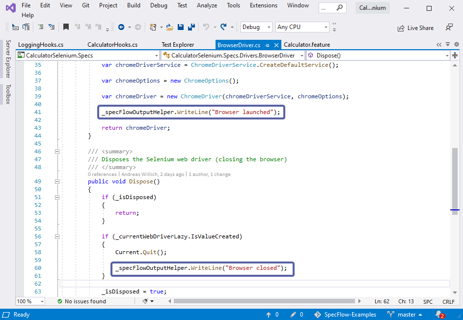
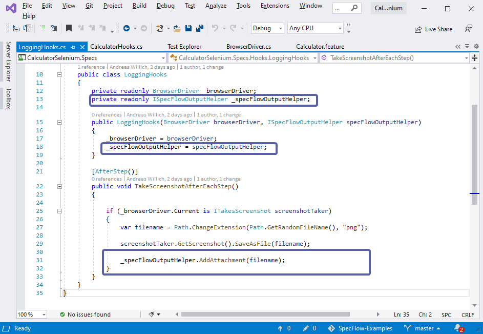
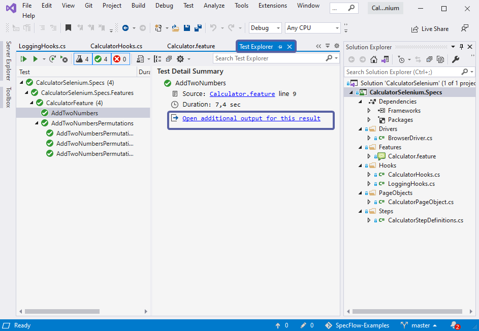
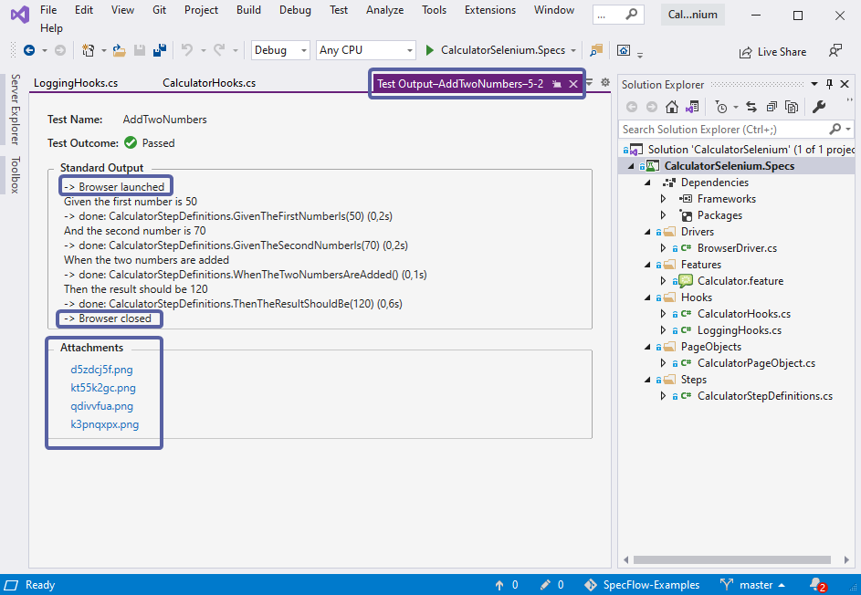
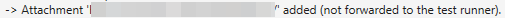
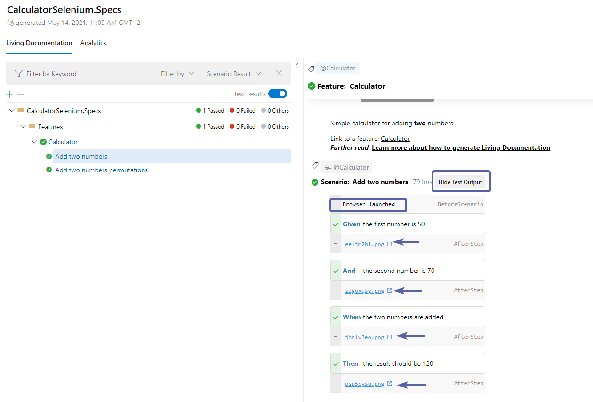

# Output API

The SpecFlow Output API allows you to display texts and attachments in your IDE's test explorer output window and also in SpecFlow+LivingDoc.

To use the SpecFlow output API interface you must inject the `ISpecFlowOutputHelper` interface via [Context Injection](../Bindings/Context-Injection.md):

```csharp
    private readonly ISpecFlowOutputHelper _specFlowOutputHelper;

    public CalculatorStepDefinitions(ISpecFlowOutputHelper outputHelper)
    {
        _outputHelper = outputHelper;
    }
```

There are two methods available:

### WriteLine(string text)

This method adds text:

```csharp
    _specFlowOutputHelper.WriteLine("TEXT");
```

### AddAttachment(string filePath)

This method adds an attachment and requires the file path:

```csharp
    _specFlowOutputHelper.AddAttachment("filePath");
```

*> Note: The attachment file can be stored anywhere. But it is important to keep mind that if a local file is added, it will only work on your machine and not accessible when shared with others.*

*> Note: Handling of attachments depends on your runner. MStest and NUnit currently support this feature but xUnit and SpecFlow+ Runner do **not**.*

## Example

This example is based on the [Selenium with Page Object Model Pattern](../ui-automation/Selenium-with-Page-Object-Pattern.md) project which tests a simple calculator web application. You can download the repo for this example [here](https://github.com/SpecFlowOSS/SpecFlow-Examples/tree/master/OutputAPI).

The `_specFlowOutputHelper.WriteLine` is used to indicate when the browser launches and closes:



Since this project tests a web application using a browser, the `_specFlowOutputHelper.AddAttachment` method has been used in the logging [Hooks](../Bindings/Hooks.md) to display the saved screen shots taken during testing:



### Results

To view the output window in Visual Studio, go to the text explorer and click on *Open Additional output for this result*:



The resulting output for the example project used above would look like this:



The added text lines on browser launch and termination can help you easily identify the exact point at which the action takes place. The screen shots taken during testing are all also listed as image files under *Attachments*.

If an attachment fails, the output explorer will display this message:



In SpecFlow+LivingDoc, no additional setup is required, simply [generate LivingDoc](https://docs.specflow.org/projects/specflow-livingdoc/en/latest/LivingDocGenerator/Using-the-command-line-tool.html) as you normally do. You can then view the output texts and attachments by toggling the *Show/Hide Test Output* :



*> Note: If the test output toggle is missing, it may be that you are on an older version of SpecFlow+LivingDoc, click [here](https://docs.specflow.org/projects/specflow-livingdoc/en/latest/LivingDocGenerator/Installing-the-command-line-tool.html) to update to the latest version.*

*> Note: The Output API in SpecFlow+LivingDoc supports the following four [Hooks](../Bindings/Hooks.md) :*

- *BeforeScenario,*
- *AfterScenario,*
- *BeforeStep,*
- *AfterStep*
