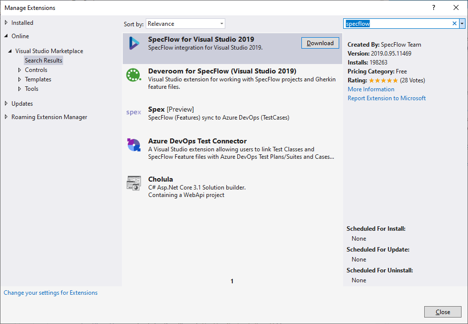
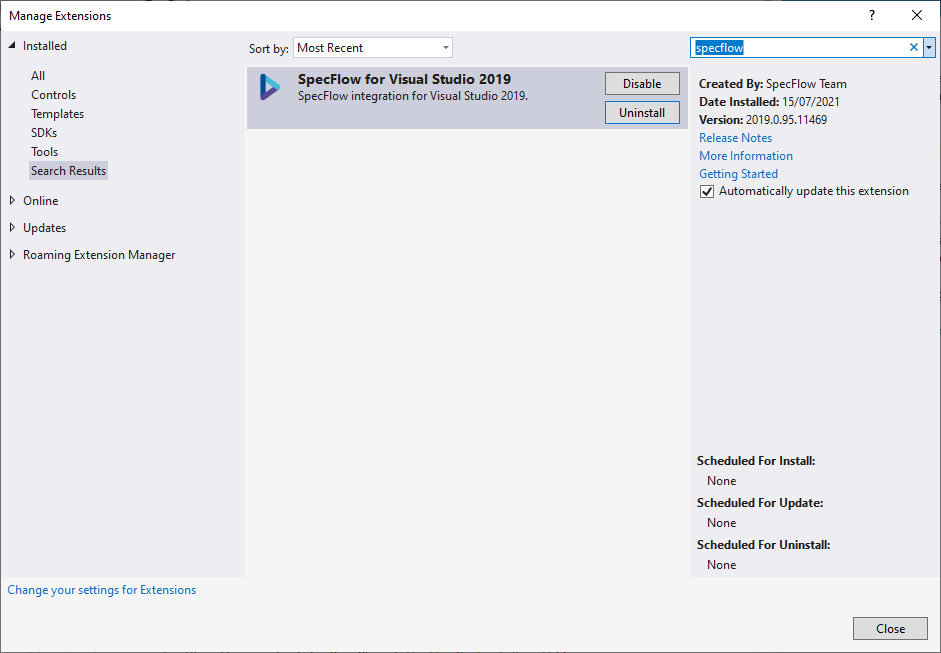

# Visual Studio Installation

The integration packages can also be downloaded and installed separately from the Visual Studio Gallery:  

* [VS2019 integration](https://marketplace.visualstudio.com/items?itemName=TechTalkSpecFlowTeam.SpecFlowForVisualStudio)
* [VS2017 integration](https://marketplace.visualstudio.com/items?itemName=TechTalkSpecFlowTeam.SpecFlowforVisualStudio2017)

or through the Visual Studio extensions:

**1-** Open Visual Studio.

**2-** Navigate to ***Extensions ➡ Manage Extensions ➡ Online*** and search for "SpecFlow" in the search bar.

**3-** Hit ***Download*** to begin the installation. You will need to restart Visual Studio for the installation to complete

Once the extension is successfully installed, you can see it in the list of "Installed extensions" in  ***Extensions ➡ Manage Extensions*** dialog of Visual Studio.

The below video is from our getting started guide which covers the installation of SpecFlow's Visual Studio extension. If you are new to SpecFlow we highly recommend you to go through this [getting started guide](https://docs.specflow.org/projects/getting-started/en/latest/GettingStarted/Step1.html).

<iframe width="560" height="315" src="https://www.youtube.com/embed/tDEgfCn31o0" frameborder="0" allow="accelerometer; autoplay; clipboard-write; encrypted-media; gyroscope; picture-in-picture" allowfullscreen></iframe>
