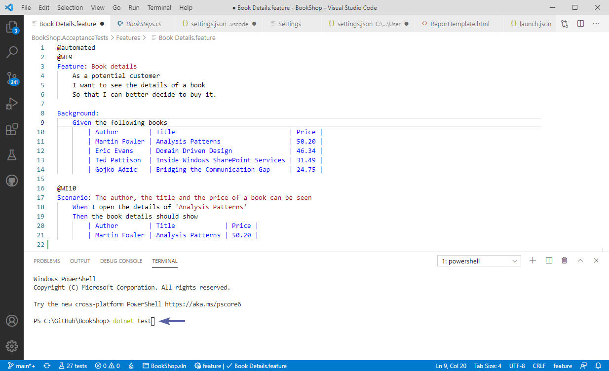
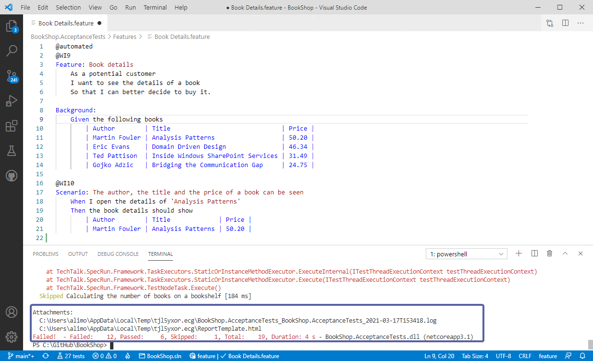

# Test Execution

The best way to execute your tests is to use the VS Code terminal, simply open the terminal type in `dotnet test` and hit enter:

You can then view the attachments, log file, and an overall results:

***> Note:** The attachments above would vary depending on the runner you are using. In our example we are using the [SpecFlow+Runner](https://docs.specflow.org/projects/specflow-runner/en/latest/).*
