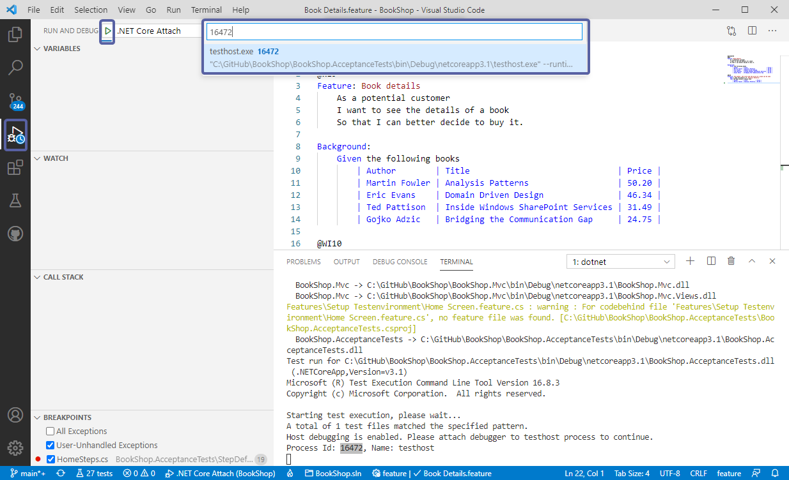

# Debugging

Follow the below steps to setup your VS Code environment for debugging:

**1-** Click on the ***Run and Debug*** (Ctrl + Shift + D) button on the left pane and then click on ***Create a launch.json file***. VS Code will then ask you what kind of environment you want to debug, select **.NET Core**:


Next, you will have to choose the project you want to debug. Select the project and VS Code will then create a **launch.json**


**2-** Once the **launch.json** file is created by VS Code you will see the debug options on the left pane. There are two debug operations to choose from here, **.NET Core Launch (Consosle)** which is for console applications and **.NET Core Attach** which is what we are going for in this example, Select ***.NET Core Attach***.


**3-** Open a new Terminal and enter the below into the terminal and hit Enter to set it up for debugging:

``` powershell
$env:VSTEST_HOST_DEBUG=1
```

The terminal is now ready for debugging, Enter `dotnet test` followed by your project and hit Enter:


**4-** dotnet test will then start in debug mode and display the test host process ID on which you can attach the debugger to:


**5-** Copy the process ID number and navigate back to debug menu on the left pane and click on the ▶ icon next to **.NET Core Attach** and paste the process ID number in the displayed search box and select ***testhost.exe***:



**6-** The debugger menu will then open up and you can see additional debugging options:


**7-** Now would be a good time to navigate to your files and set your break points before hitting the start button the menu:


**8-** The debugger menu buttons give you the options to navigate around and once finished you can disconnect by using the red unplug button:


